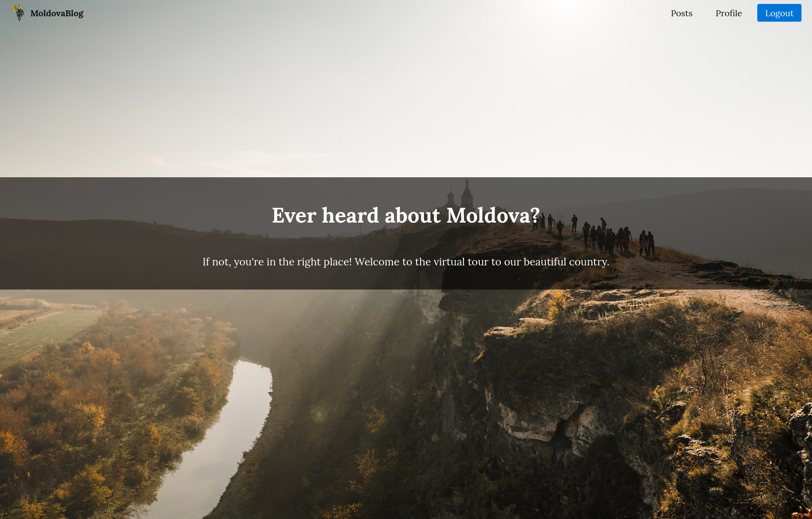
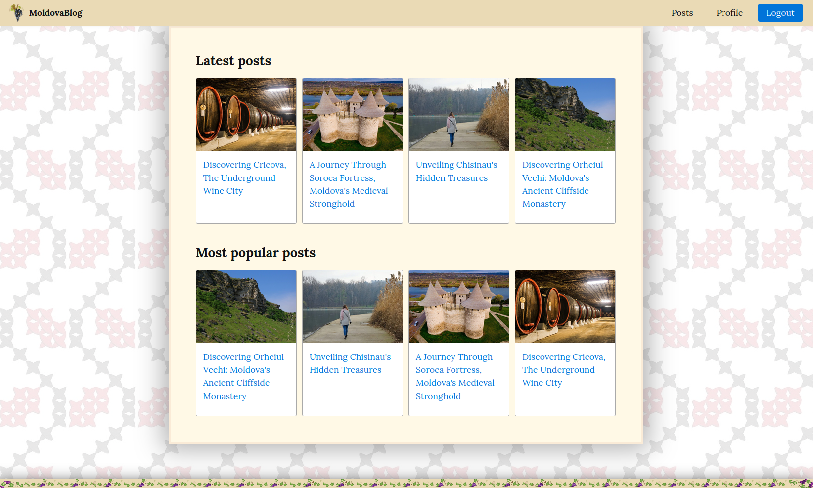
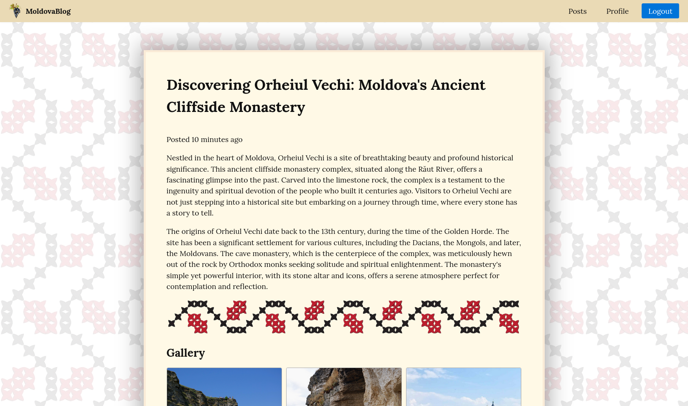
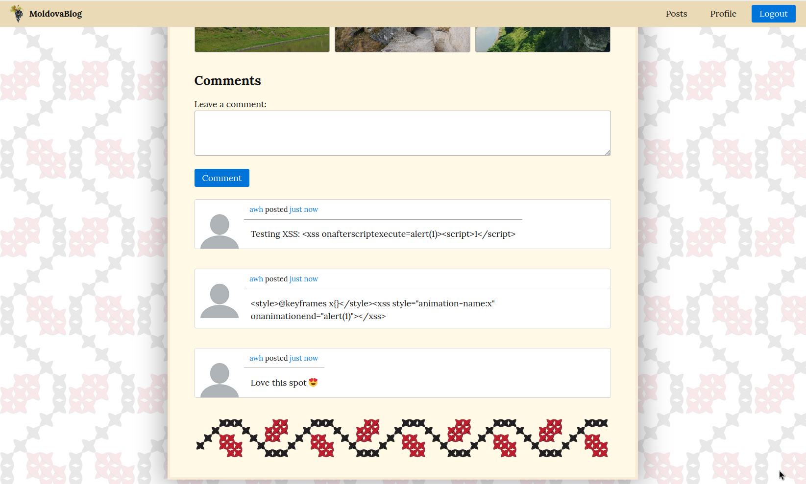
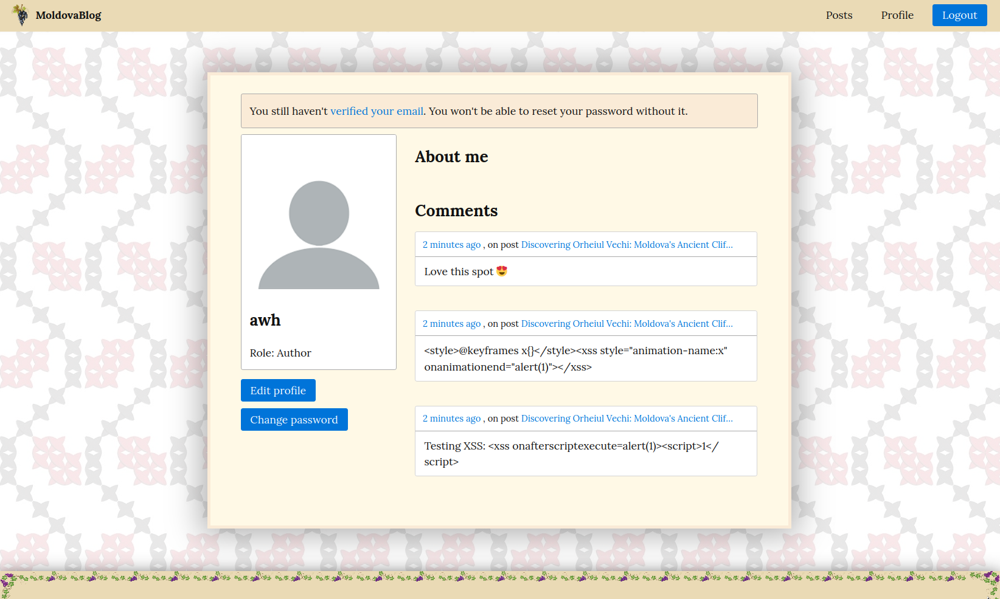
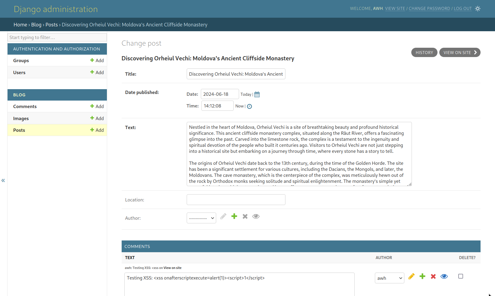
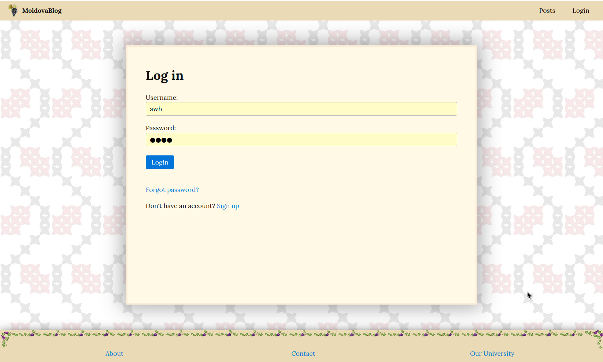
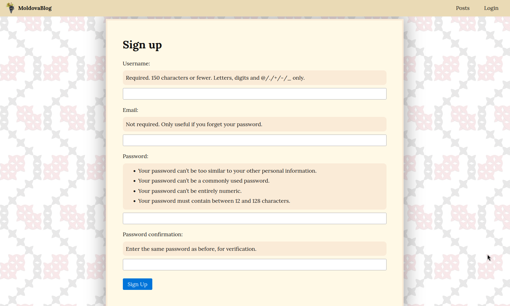

# PBL: Secure Application Development

- Team 6
- Web app in Django

# Screenshots

<p float="left">
  
  
  
  
  
  
  
  
</p>


# Requirements

    Django==5.0
    Python==3.11

It's recommended to use a virtual environment for this project. For example:
``` sh
python3 -m venv .venv
source .venv/bin/activate
# on windows type this instead:
# .\.venv\Scripts\activate
```

# Installation

Clone this repository and install the dependencies:
``` sh
python3 -m pip install -r requirements.txt
```

Copy the example configuration to `MoldovaBlog/secret_config.py` and adapt it to your environment:

``` sh
cp ./MoldovaBlog/example_secret_settings.py ./MoldovaBlog/secret_settings.py 
```

Run these:
``` sh
python3 manage.py migrate
python3 manage.py createsuperuser  # create account for admin interface 
```

Create the media folder at your chosen `MEDIA_ROOT` (from the `secret-settings.py` file):

``` sh
sudo mkdir -p /var/www
sudo mkdir /var/www/MoldovaBlog
sudo chown <your_username> /var/www/MoldovaBlog
chgrp <your_username> /var/www/MoldovaBlog
```

# Running

``` sh
python3 manage.py migrate  # required if the models have been changed

python3 manage.py runserver
```

- homepage: http://127.0.0.1:8000/
- admin page: http://127.0.0.1:8000/admin

Things to try out:
1. Create some posts on the admin page
2. Go to the homepage and register a new user
3. Find the posts you have created
4. Leave some comments
5. Log out, log in, reset password, etc.

# Testing

Install requirements for tests:
``` sh
python3 -m pip install -r requirements-test.txt
```

Run all the tests:
``` sh
python3 manage.py test --parallel
```
